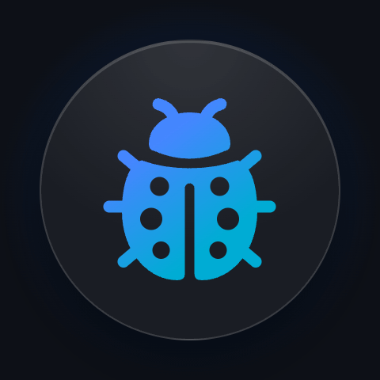

<p align="center">
  
</p>

# StreamLogsUI

An in-app log viewer for iOS. Inspect the logs, network requests and WebSocket events of your app right on the device, without a proxy or a cable, and share them with your team, Stream support or your AI agent.

`StreamLogsUI` has no dependencies, so it works with any logging library. Stream's Chat, Video and Feeds SDKs integrate it with a single line of code.

## ✨ Features

- Floating button you can drag or tuck away
- Keep using your app under the sheet
- Search messages, bodies and payloads
- Filter by level and subsystem
- JSON viewer with search
- Copy any request as cURL
- Export and import log sessions
- Share with Stream support or your AI agent

## 📋 Requirements

- iOS 16+ to present the viewer. The package can be linked by apps and frameworks targeting iOS 13+, in which case the viewer does nothing on older versions.
- Swift 6.0, Xcode 16+

## 📦 Installation

`StreamLogsUI` is distributed with Swift Package Manager. In Xcode, select **File → Add Package Dependencies…** and enter the repository URL, or add it to your `Package.swift`:

```swift
dependencies: [
    .package(url: "https://github.com/GetStream/stream-logs-ui-swift.git", branch: "develop")
],
targets: [
    .target(
        name: "YourApp",
        dependencies: [.product(name: "StreamLogsUI", package: "stream-logs-ui-swift")]
    )
]
```

The viewer is meant for debug builds, internal builds and demo apps. Gate it behind a debug flag or a hidden setting before shipping it to the App Store.

## 🚀 Usage

Record log messages in `InMemoryLogRecorder.shared` and present the viewer:

```swift
import StreamLogsUI

// Presents the viewer as a resizable sheet above the app.
// At the small and medium heights, the app behind it stays interactive.
LogViewer.present()

// Or show a floating button that opens it. Drag the button past a screen edge to tuck it away.
LogViewer.showsFloatingButton = true

// Or present it when the device is shaken. Only enable this in debug builds.
LogViewer.presentsOnShake = true

// Or embed the list in your own navigation stack.
NavigationStack {
    LogListView()
}
```

### Recording logs

`LogEntry` only requires a level and a message. The other fields are optional, and `metadata` holds any extra key-value pairs, which are displayed and searchable. Besides the predefined levels, apps can define their own, e.g. `LogEntry.Level(severity: 45, name: "SECURITY")`.

```swift
InMemoryLogRecorder.shared.record(LogEntry(
    level: .info,
    subsystems: ["Checkout"],
    message: "Payment confirmed",
    metadata: ["orderId": "8F2C1A"]
))
```

Entries with the predefined HTTP metadata keys are shown as requests, with their method and status. Their request and response bodies can be browsed and searched in a JSON viewer, and their cURL command can be copied. The `.http` helper creates these keys from a request and its response:

```swift
InMemoryLogRecorder.shared.record(LogEntry(
    level: .debug,
    message: "200 GET /users",
    metadata: .http(request: request, response: response, responseBody: data, error: error)
))
```

The keys can also be set one by one, e.g. `[.httpMethod: "GET", .httpURL: "https://example.com/users"]`. Entries with `.webSocketReceivedPayload` or `.webSocketSentPayload` are shown as WebSocket messages, with their `.webSocketEventType`.

## 🧩 Stream SDKs

Each Stream SDK has a product that sends its logs to the viewer:

| SDK | Package | Product |
| --- | --- | --- |
| [Chat](https://github.com/GetStream/stream-chat-swift) | `stream-chat-swift` | `StreamChatLogsUI` |
| [Video](https://github.com/GetStream/stream-video-swift) | `stream-video-swift` | `StreamVideoLogsUI` |
| [Feeds](https://github.com/GetStream/stream-feeds-swift) | `stream-feeds-swift` | `StreamFeedsLogsUI` |

Add the product of your SDK to your app, and install the viewer when the app launches, e.g. with Chat:

```swift
import StreamChatLogsUI

#if DEBUG
LogViewer.install()
LogViewer.showsFloatingButton = true
#endif
```

The SDK's logs, including its HTTP requests and WebSocket events, are then recorded and displayed in the viewer. Its settings screen controls the SDK's logger at runtime: the console and the log viewer each have their own switch, level and subsystems. The console starts with the destination types, level, subsystems and format of `LogConfig`, so configure them before installing the viewer, and don't change them afterwards.

To manage the logger's destinations yourself instead, add the product's `LogViewerDestination` to `LogConfig.destinationTypes` or `LogConfig.destinations`.

Apps that use several Stream SDKs install the viewer once, with the product of any of them: the SDKs share their logger, so the logs of all of them are recorded. The settings list the subsystems of the SDK whose product installed the viewer.

## 🔌 Other logging libraries

<details>
<summary>swift-log</summary>

```swift
import Logging
import StreamLogsUI

struct LogViewerHandler: LogHandler {
    let label: String
    var logLevel: Logger.Level = .trace
    var metadata: Logger.Metadata = [:]

    subscript(metadataKey key: String) -> Logger.Metadata.Value? {
        get { metadata[key] }
        set { metadata[key] = newValue }
    }

    func log(
        level: Logger.Level,
        message: Logger.Message,
        metadata: Logger.Metadata?,
        source: String,
        file: String,
        function: String,
        line: UInt
    ) {
        InMemoryLogRecorder.shared.record(LogEntry(
            level: LogEntry.Level(level),
            subsystems: [label],
            message: message.description,
            functionName: function,
            fileName: (file as NSString).lastPathComponent,
            lineNumber: line,
            metadata: Dictionary(uniqueKeysWithValues: self.metadata.merging(metadata ?? [:]) { $1 }.map { key, value in
                (LogEntry.MetadataKey(rawValue: key), value.description)
            })
        ))
    }
}

private extension LogEntry.Level {
    init(_ level: Logger.Level) {
        switch level {
        case .trace: self = .trace
        case .debug: self = .debug
        case .info: self = .info
        case .notice: self = .notice
        case .warning: self = .warning
        case .error: self = .error
        case .critical: self = .critical
        }
    }
}

LoggingSystem.bootstrap { label in
    MultiplexLogHandler([StreamLogHandler.standardOutput(label: label), LogViewerHandler(label: label)])
}
```

</details>

<details>
<summary>CocoaLumberjack</summary>

```swift
import CocoaLumberjackSwift
import StreamLogsUI

final class LogViewerLogger: DDAbstractLogger {
    override func log(message logMessage: DDLogMessage) {
        InMemoryLogRecorder.shared.record(LogEntry(
            date: logMessage.timestamp,
            level: LogEntry.Level(logMessage.flag),
            message: logMessage.message,
            threadName: logMessage.threadName,
            functionName: logMessage.function,
            fileName: (logMessage.file as NSString).lastPathComponent,
            lineNumber: logMessage.line
        ))
    }
}

private extension LogEntry.Level {
    init(_ flag: DDLogFlag) {
        switch flag {
        case .error: self = .error
        case .warning: self = .warning
        case .info: self = .info
        case .debug: self = .debug
        default: self = .trace
        }
    }
}

DDLog.add(LogViewerLogger())
```

</details>

## 📤 Sharing logs

The share button in the log list exports all logs, or only the filtered ones, as a JSON file that can be sent from the share sheet, for example by a customer reporting an issue. The same menu imports a file, which opens in a separate, read-only list with the app version, OS and device that recorded it, so it never mixes with the live logs.

The file is a `LogSession`, which can also be read and written in code, for example to attach logs to a bug report:

```swift
let data = try LogSession(entries: InMemoryLogRecorder.shared.entries).encoded()
let session = try LogSession(data: data)
```

`LogEntry` is `Codable`, and dates are written as ISO 8601 strings with milliseconds.

## 🎨 Customization

- **Settings:** `LogSettings` holds the destinations shown in the settings screen, each with its own switch, level and subsystems. Use `apply(_:)` to rebuild your logger's destinations when they change.
- **Initial filter:** set `LogViewer.defaultFilter`, or pass a `LogFilter` to `LogViewer.present(filter:)` or `LogListView(filter:)`, to open the viewer with levels, subsystems or search text already applied.
- **Appearance:** `LogViewerAppearance` sets the color and icon of each level, and the subsystem and search highlight colors. Pass it to `LogViewer.present(appearance:)` or apply it with the `logViewerAppearance(_:)` modifier.
- **Storage:** `InMemoryLogRecorder` keeps the latest 5,000 entries by default. To display entries kept elsewhere, for example in a file that survives app launches, implement `LogRecorder` and pass it to `LogViewer.present(recorder:)` or `LogListView(recorder:)`.

## 🧪 Development

```sh
xcodebuild test \
  -scheme StreamLogsUI \
  -destination 'platform=iOS Simulator,name=iPhone 17 Pro'
swiftlint lint --config .swiftlint.yml --strict
swiftformat --config .swiftformat --lint .
```

## 📄 License

See [LICENSE](LICENSE).
